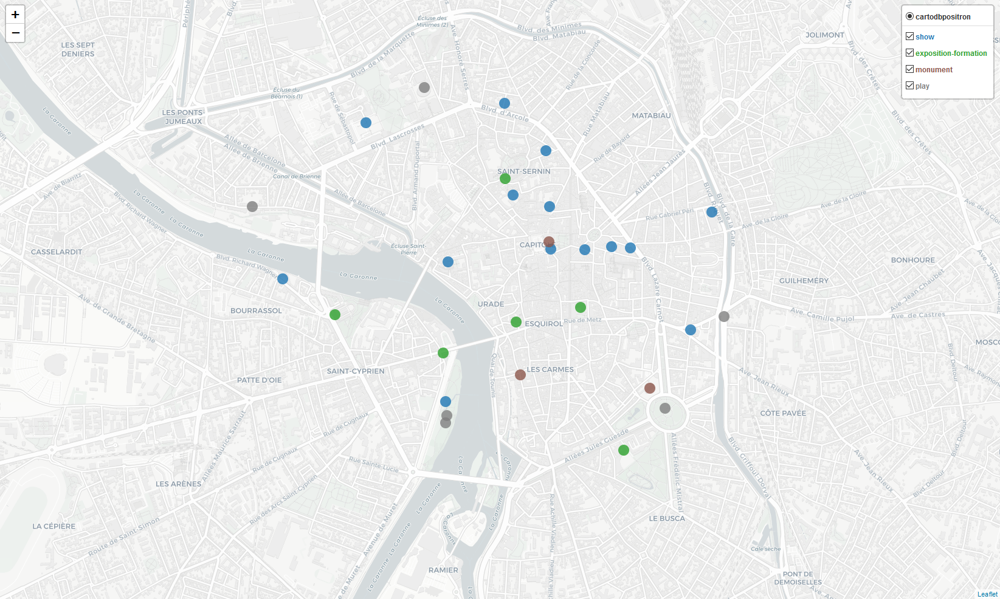
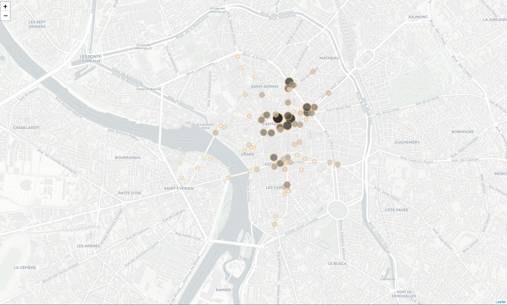
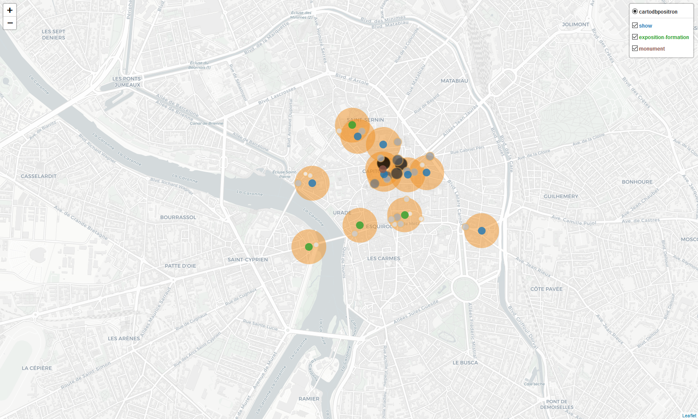
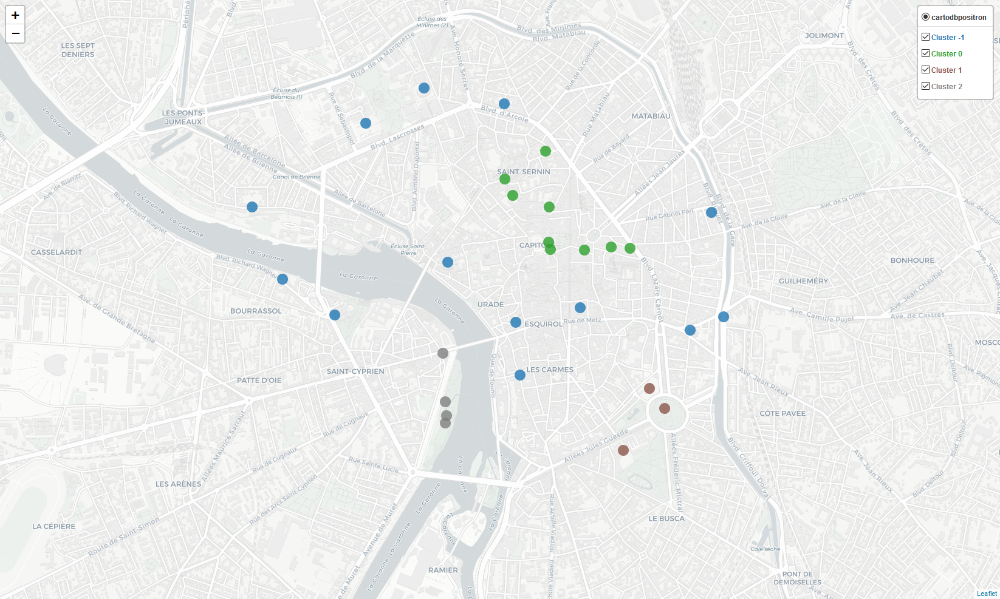

# Culture venues clustering in Toulouse

## Table of content

- [Project](#project)
- [Synopsis](#synopsis)
  * [Problematic](#problematic)
  * [Data used](#data-used)
    + [1. Cultural venues](#1-cultural-venues)
    + [2. Pedestrian count](#2-pedestrian-count)
- [Analysis](#analysis)
  * [1. Cultural venues](#1-cultural-venues-1)
  * [2. Pedestrian flows dataset](#2-pedestrian-flows-dataset)
    + [**Proximity selection**](#--proximity-selection--)
  * [Machine Learning Clustering](#machine-learning-clustering)
    + [**a. Latitude and longitude**](#--a-latitude-and-longitude--)
      - [Hierarchical clustering](#hierarchical-clustering)
      - [Desnity-based clustering](#desnity-based-clustering)
    + [**b. Adding category venues in clustering algorithm**](#--b-adding-category-venues-in-clustering-algorithm--)
    + [**c. Adding pedestrian flow counts in clustering algorithm**](#--c-adding-pedestrian-flow-counts-in-clustering-algorithm--)
      - [Hierarchical clustering](#hierarchical-clustering-1)
      - [Desnity-based clustering](#desnity-based-clustering-1)
- [Conclusion](#conclusion)

## Project

Author: Akim van Eersel  
Date: 2020-12-14

This work is made for the final project of [Applied Data Science Capstone by IBM/Coursera](https://www.coursera.org/learn/applied-data-science-capstone).  

The report is embedded in this README file, named as such to get better readability on Github repository page. This report is focusing on the main steps to get all the data science workflow and presents most valuable blocks of the full analysis.

The full analysis and python code can be viewed in the dedicated [Jupyter notebook](https://github.com/vanAkim/IBM_Data_Science_Professional_Certificate/blob/main/9-Capstone_Project/FinalProject/Culture%20venues%20clustering%20in%20Toulouse.ipynb) on Github.  
**However, in this notebook, many maps are rendered through Folium framework, and can't be viewed on Github preview page. Thus, it's better to see it with [Nbviewer service](https://nbviewer.jupyter.org/github/vanAkim/IBM_Data_Science_Professional_Certificate/blob/main/9-Capstone_Project/FinalProject/Culture%20venues%20clustering%20in%20Toulouse.ipynb).**

## Synopsis

### Problematic

Toulouse is the fourth largest city in France and although it remains relatively human sized, like most European cities apart from the capitals, there is a strong socio-economic activity. Several reasons could explain it, it is among others the European capital of the aeronautical and space industry, and a city with many universities. There is therefore a strong mixing of the population and a significant dynamism within the city.

Like many other cities in the world, especially with a large population of students and young workers, some neighborhoods are well-known to have many bars. Since I live there, I have at least 3 places in mind with a very high density of bars in small spaces (i.e. ~ 10/20 next to each other). It would be interesting to have a more in-depth look at this phenomenon, however the issue referred into this report concerns clustering but not with regard to bars (in the same way as streets containing only shops). The theme is the one of culture and related places for the public.

Since there are clusters of bars, are there geographic groupings of cultural points?
And if so, are these cultural places more or less grouped according to their category?

This summary analysis could be an entry point for the City of Toulouse to know the extent of its cultural area. In addition, with related data and analyzes on these cultural places (e.g. number of visitors over years, proximity to public transports, etc.) it might be possible to know whether it is better to implement a museum away or not from other points of interest. The same conclusion can be drawn for the cultural industry, does one cinema close to another attract more or less spectators?

This report does not have as much ambition and just seeks to present a distribution of cultural places referenced on Foursquare, with a summary analysis on their geographical distribution and with respect to their category. But could be helpful for more in-depth conclusions.

### Data used

#### 1. Cultural venues

The main points with their location (latitude & longitude) and category, i.e. cultural places, will be retrieved from Foursquare databases using their API.   

However, Foursquare's data is relatively biased since among all the cultural places in Toulouse (it is possible, for example, to find lots of these locations in different data sets on [Data.toulouse-metropole](https://data.toulouse-metropole.fr/explore/?refine.theme=Culture&sort=modified) website) a very small fraction is identified. This may be the result that the Foursquare service is little used by the resident or tourist population in this city or in France, or the way Foursquare generates its points of interest, or that cultural places visitors are rarely inclined to list their experiences on Foursquare.   

Nevertheless, it is possible in a way to take advantage of this bias without too much impacting the initial problematic. Indeed, since the places of Foursquare are brought and developed by the users on the spot, the sites listed are probably those which attract the most attention. So, under the assumption that Foursquare places are the most attractive ones in the city, then the above questions are still relevant when looking only at the main cultural places.

#### 2. Pedestrian count

On [Data.toulouse-metropole](https://data.toulouse-metropole.fr/explore/dataset/comptages-pietons/information/?sort=annee&location=16,43.60208,1.44634&basemap=jawg.streets) webpage a dataset is available which counts the pedestrian flows in different streets of Toulouse. This `comptages-pietons` dataset, from **Toulouse Métropole**, with last data input on **2020-02-13**, is made available under the [Open Database License](http://opendatacommons.org/licenses/odbl/1.0/) *([local license text](https://github.com/vanAkim/IBM_Data_Science_Professional_Certificate/blob/main/9-Capstone_Project/FinalProject/ODC%20Open%20Database%20License%20(ODbL).md))*. Any rights in individual contents of the database are licensed under the [Database Contents License](http://opendatacommons.org/licenses/dbcl/1.0/).  

These points could help better to cluster the cultural venues. In addition, another question that could have been added to the problematic is whether there is a correlation between the geographical position and the category of cultural places with the number of pedestrians in nearby streets. It's easy to think that the position of a historical monument or museum is determined by its long history and not by the flow of pedestrians of recent years. Conversely, a mainstream cinema probably preferred to set up in a busy street.

Unfortunately, the measurement methodology is slightly insufficient to have the most enlightened information. Indeed, only a few streets of the city were targeted, within a very short timeframes (~1h/day), and just one day a year. Also, some pedestrians can be counted several times in succession or on the contrary some others never counted. The advantage of this method lies in the estimation of pedestrian traffic and its evolution. That's why none related question was added to the problematic section, this dataset is mostly a bonus exploratory analysis with a potential relevant result.

## Analysis 

### 1. Cultural venues

From the Foursquare API, 29 sites were collected across 21 cultural categories.  
For futher analysis, it's important to group *(also with english translation)* categories venues. I chose 4 major areas of binning:
+ Activities offering a show *(cinema, theatre, spectacle, concert/festival)* : `show`
+ A place to visit: `monument`
+ Activities requiring play *(sport, danse, games, green/play grounds)*: `play`
+ Activities requiring interaction *(reading, moving, learning)*: `exposition-formation`

Now all the sites are divided according to the following breakdown:

Category | Amount
:------ | :------:
show                 |   14
exposition-formation |    6
play                 |    6
monument             |    3

**Such low occurrences, even for the `show` category, prevent any significant statistical analysis, and probably isn't enough to create a performant clustering algorithm. Nonetheless, that's the data we have, so let's try to do something with it.**

Here is the map showing the different places concerned in the city of Toulouse:

As said previously, **there are few sites and since their distribution is quite wide without any obvious pattern (though, there seems to be a little trend at the top right), a clustering only by their geographical location might be irrelevant.**  
Let's review the previous map, distinguishing the different categories by color.

1. **Even if `show` is predominant and bias the view of the map, it seems that `show` venues are more located on the upper right of downtown, the dense pattern identified before.**
2. **Other categories are much more difficult to judge because each has too small occurrences.**  
 
  
### 2. Pedestrian flows dataset

Before continuing on the algorithmic step, the pedestrian flows dataset must be loaded.

Measurements are made out of 3136 counts in 96 differents streets over 5 years.  
After cleaning irrelevant values, and grouping by measurement addresses and years to get the median value, 79 data points remain.

For better understanding, the map of Toulouse is drawn with all pedestrian flow counts.

**Once again, this number of measurements is relatively low, but above all the distribution of points is directed and not homogeneous.** 

This certainly distorts the real representation of the flow of pedestrians in Toulouse. Especially since I live in this city, I know that the agglomerations of the measurement points at the "Capitole" (historical center among others), "Esquirol" (commercial streets) and "Les Carmes" / "Daurade" (bars & pubs) are cleverly chosen since they are the densest crossing points in the city.

In this sense, the primary goal of this dataset must be to mainly measure the streets with the most important pedestrian flows. Which isn't helpful with your problematic, especially with the previous Foursquare collected sites already biased.

That's why I was precautious in the problematic development. Since I had the intuition of not being the most relevant dataset when I was searching and gathering intels to go along Foursquare points. Now, this little exploratory visualization confirms my first impressions. **However, these data is unique and the only one available of it's kinds. So I'll keep going on and try to get the most I can from it. We have the data available and not always the appropriate.**

#### **Proximity selection**

The chosen way to link the two databases is to select the nearest pedestrian flow metrics from each Foursquare site. For this, it is necessary to define a proximity criterion.  
Here, this criterion will be a simple disk area centered on the different cultural places. If a point is present in an area of a disk, then it will be defined as being near the site at the center of the disk.

After a few tests, an area with a radius of 140 meters seems to be suitable for being a relatively narrow perimeter but sufficient to include a minimum number of points.

Below is the map showing the previous cultural venues, now along the pedestrian flow counts and the proximity area with 140 meters radius for each Foursquare sites.

And now the same map with data points filtered by proximity criteria.

From 79 pedestrian flow counts, 29 where close enough. And from 29 Foursquare initial cultural venues, 12 where close to at least 1 pedestrian flow count.   
Which in this few data points projects is even more reducing it down, leaving only 2 categories:

Category | Amount
:------ | :------:
show                 |   7
exposition-formation |   9

### Machine Learning Clustering

I found 2 clustering algorithms suited well to our problem: hierarchical and density-based *(DBScan)* methods.

#### **a. Latitude and longitude**

##### Hierarchical clustering

After finding the best fitting parameters with dendrograms selection, for the first instance only geographic feature (latitude and longitude) is taken into account.  
The map view of each venue colored by their cluster group is giving an interesting cleavage:

With this method, considering only the geographical aspect without the cultural category of each place, clustering result seems surprisingly adequate.  
Generally speaking each category seems distributed with a dominance in one specific cluster. 

However, as specified during data collection, due to the representation bias of each category *(14-6-6-3)* and their very low occurrences, clustering is necessarily less suited to certain category (such as `monument` which only has a total of 3 places).

We find again an upper right cluster, the number 1, which includes 8 *(57%)* of `show` venues. This group is strongly linked both to the geographical layout and also to the presence of `show` sites. While for the other clusters, the geographical aspect seems to have a more important place in view of the distribution of categories.

##### Desnity-based clustering

The DBScan algorithm isn't showing anything more than previous statements, it's refining the same intuition about the top right cluster mostly of `show` venues. Nonetheless, to get a better feeling of it, the map view of each venue colored by their cluster group is created below:

*NOTE: cluster labeled '-1' are outliers points, specific to the use of density-based clustering algorithms.*

---

#### **b. Adding category venues in clustering algorithm**

**Adding culture category highly skew results and only points out the identical result as the one in [exploratory analysis in the data collecting stage](#proximity-selection) for the hierarchical clustering, which are only places separated by their respective categories.**

DBScan method doesn't achieve better. Almost all data points are outliers, yet two clusters exist.  
Both are made exclusively by category venue, and among them, again show category cluster is present, cluster 1. Which have the same amount of cultural places, 8 (57%), as the clustering made the hierarchical method only with latitude and longitude (but not all the same places).  

In both cases, map views are of little interest.

---

#### **c. Adding pedestrian flow counts in clustering algorithm**

After finding optimal parameters and features to include, latitude, longitude, category and median pedestrian flow counts are used to get some clustering processes.

##### Hierarchical clustering

This method delivers a "better" conclusion with 4 clusters. Among these 4 clusters, the two venue categories are mainly distributed in a different cluster.  
It is also interesting to note that the major proportion (but not the amount) of show, 57%, is the same as the one observed in hierarchical clustering with only location variable.

However, with fewer data points, the usual upper right cluster mostly made of show probably remains but must be heavily sliced. Here's the map view:

From the previous upper right cluster, only its shadow remains. 

**The median of the pedestrian flow counts plays an important role in the clustering effect, probably more than category feature.**  

Indeed,
+ cluster 0, `show` exclusive, group flow counts between [1100, 1350]
+ cluster 1, gets [1800, 1950] values
+ cluster 2, gets [800, 950] values
+ cluster 3, gets [550, 650] values

**This data points and method doesn't show relevant or different conclusions from before. For now, adding pedestrian flow counts is too much impacting the data by reducing it. Thus, unfortunately but expected, this analysis is inconclusive.**

##### Desnity-based clustering

**This method is worthless than the hierarchical, and not better conclusion can be made.**

## Conclusion

> *So from the original problematic,*  
>**since there are clusters of bars, are there geographic groupings of cultural points?**  
>**And if so, are these cultural places more or less grouped according to their category?**

In a sense, it is possible to say that Toulouse has at least one cluster of cultural places, and that it is strongly linked to a cultural category, namely `show` places. But these data points do not make it possible to judge cultural venues clusters in the same way the bars/pubs clusters which are very dense and less dispersed.  
That conclusion can be made only with geographical variable clustering and then compare cluster labels to category venues.

**Adding categories and/or pedestrain flows counts in clustering algorithms are not adding any value. These somewhat disappointing further analyzes show nothing more than what has already been explained. In addition, cultural categories almost has a detrimental effect on the clustering process compared to one that only takes into account the geographic position.**

**Unfortunately, pedestrian flow counts doesn't suit well with Foursquare cultural venues dataset in order to find some clusters.**